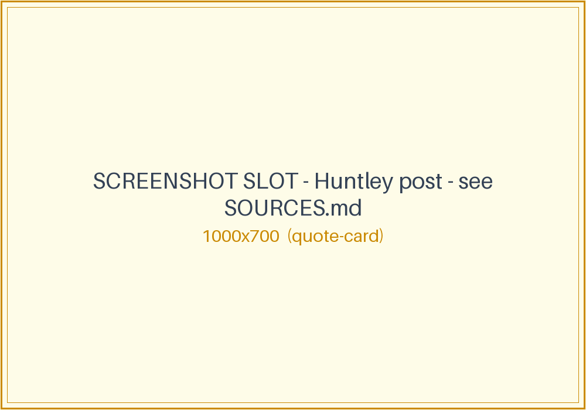
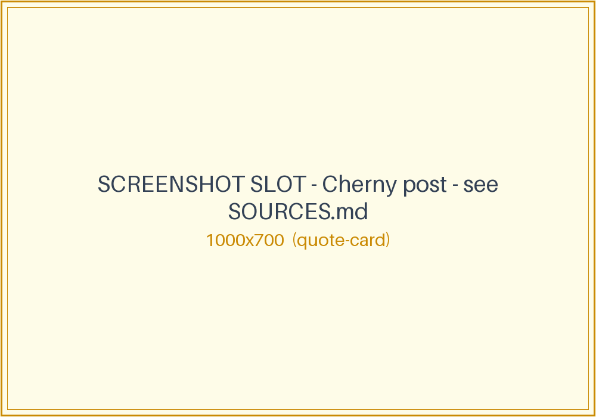
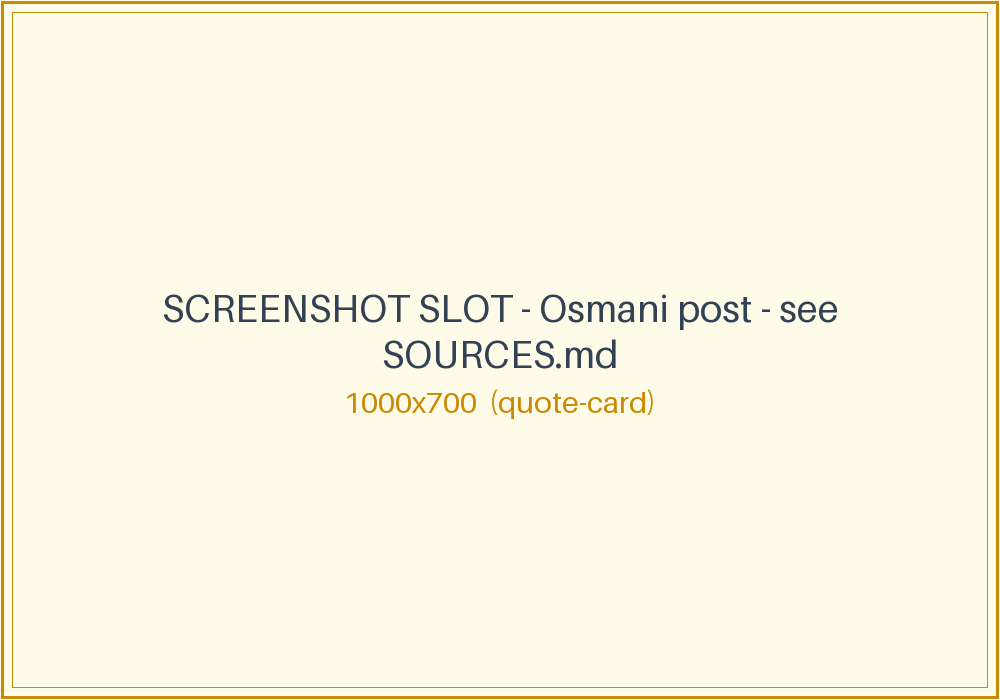

# Loop Engineering Handbook


[](LICENSE) [](.github/workflows/ci.yml) [](examples/README.md)

> Loop engineering is the practice of running an AI coding agent in a **governed, verifiable loop** until a clearly defined goal is met.

**[Learn loop engineering →](docs/README.md)**  ·  **[Copy a loop →](library/README.md)**  ·  **[See one run →](examples/README.md)**

The only loop-engineering repo where you can see the **logs**, the **cost**, and the **output** of every example — including work that isn't code.

> **This handbook eats its own dog food.** It was assembled by a governed loop running in [Claude Code](https://www.anthropic.com/claude-code) — the guide, the prompt library, and all seven worked examples were produced and verified loop-by-loop, under the same loop-contract discipline (Done-when, Evidence, If-blocked) the handbook teaches. Loop engineering isn't a thing we *describe* here; it's the thing that *made* the repo.

## Loop in 30 seconds

A **loop contract** is six fields. Fill them in and you have a governed loop:

```
Goal:        <the outcome, in one sentence>
Context:     <repo / inputs / the source of truth the agent may use>
Constraints: <read-only? sandbox/worktree? cost cap? rate?>
Done-when:   <the single verifiable stop condition a separate checker can test>
Evidence:    <the artifacts that prove Done-when is met (logs, repro, ledger, .xlsx)>
If-blocked:  <halt rule + escalation: max no-progress passes, wall-clock cap, who to ask>
```

Then run one. In [the overnight code review](examples/1-overnight-217-review/README.md), the *ungoverned* loop burned **$217.34** re-reviewing an unchanged PR queue overnight; the *governed* one — same job, a Done-when and a cost cap — finished in **$11.20**. *(Illustrative — as of June 2026, verify before relying; the receipts are in the example.)*

See the canonical template, with each field explained, in [the loop contract](docs/the-loop-contract.md).

## What this repo is

Three ways to learn loop engineering, in priority order:

1. **A guide** you learn from — [docs/](docs/README.md): what it is, `/goal` vs `/loop`, benefits, risks + cost, recommendations.
2. **A copy-paste prompt library** — [library/](library/README.md): one card per loop, plus a machine-readable [`catalog.json`](library/catalog.json) and [`llms.txt`](library/llms.txt).
3. **Seven worked examples** — [examples/](examples/README.md): loops actually running, *with the receipts* (iteration logs, cost ledgers, before/after, charts, real `.xlsx` output).

## About this repo

- [Contributing](CONTRIBUTING.md) · [For agents](AGENTS.md) · [FAQ](docs/faq.md) · [Sources](SOURCES.md) · [License (MIT)](LICENSE)

## Star history

_Star-history chart appears here after launch — set the owner in `repo.config.json`, then this section links `https://star-history.com/#OWNER/loop-engineering-handbook`._

## Credits

Loop engineering as a discipline grew from a lineage of practitioners:

[](https://ghuntley.com/ralph/)
[](https://x.com/steipete/status/2063697162748260627)
[](https://officechai.com/ai/i-now-just-write-loops-to-prompt-claude-code-claude-code-creator-boris-cherny/)
[](https://addyosmani.com/blog/loop-engineering/)
[](https://x.com/gdb/status/2050194039077495089)

_Each card links to its original post. Full attributions: [SOURCES.md](SOURCES.md#quote-card-sources)._

---

<sub>Everything here is **synthetic and safe** — fictional orgs, toy repos, made-up datasets. Every example carries a "reconstruction for teaching" label. Volatile facts are marked *as of June 2026 — verify before relying*.</sub>
