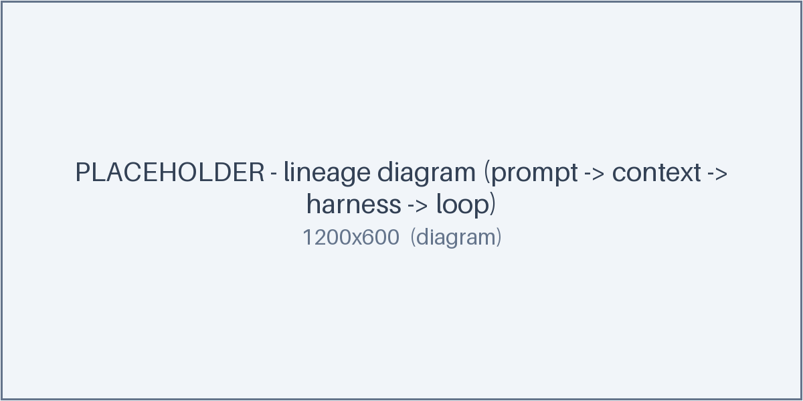

# What is loop engineering?

> **Accuracy note:** the people, dates, and figures in the origin story below are
> recorded *as of June 2026 — verify before relying*. Every external claim has a
> row in [SOURCES.md](../SOURCES.md).

## Definition

**Loop engineering** is the practice of running an AI coding agent in a
**governed, verifiable loop** until a clearly defined goal is met. Where *prompt
engineering* shapes a single turn, loop engineering shapes the **outer loop**:
what the agent does, how it checks its own work, when it stops, and what it costs.

A useful one-liner (Addy Osmani, *as of June 2026 — verify before relying*):
loop engineering is *"designing the loop the agent runs in, not just the prompt
it runs once."* See [SOURCES.md](../SOURCES.md#origin-and-lineage).

## Where the term came from

The idea predates the name. A short, labeled timeline (*as of June 2026 — verify
before relying*; sources in [SOURCES.md](../SOURCES.md#origin-and-lineage)):

| When | Who | What |
|------|-----|------|
| Jul 2025 | Geoffrey Huntley | popularized the bare **"Ralph" loop** — re-run the same prompt in a `while true` until done |
| Jun 2026 | Steinberger | a viral thread on running agents in long unattended loops |
| Jun 2026 | Boris Cherny | framing loops inside coding-agent tooling |
| Jun 2026 | Addy Osmani | named and defined **"loop engineering"** as a discipline |
| Jun 2026 | Greg Brockman | described a governed **"Ralph loop++"** |

The throughline: a one-shot prompt became a *loop*, and the loop grew
**governance** (stop conditions, cost caps, verification) until it was worth
treating as its own engineering surface.

## Prompt → context → harness → loop

The four things you actually design, from innermost to outermost:

- **Prompt** — what to do on a single pass.
- **Context** — what the agent knows this pass (repo state, inputs, the source
  of truth). Fresh context each pass beats one ever-growing transcript.
- **Harness** — the tools, permissions, and memory the agent runs inside.
- **Loop** — repeat until a verifiable done-condition (or an interval fires),
  with governance around it.

Loop engineering is mostly about the outer two rings: the **harness** and the
**loop**. The rest of this guide is how to design them.

---

Next: [/goal vs /loop basics →](02-goal-and-loop-basics.md)
