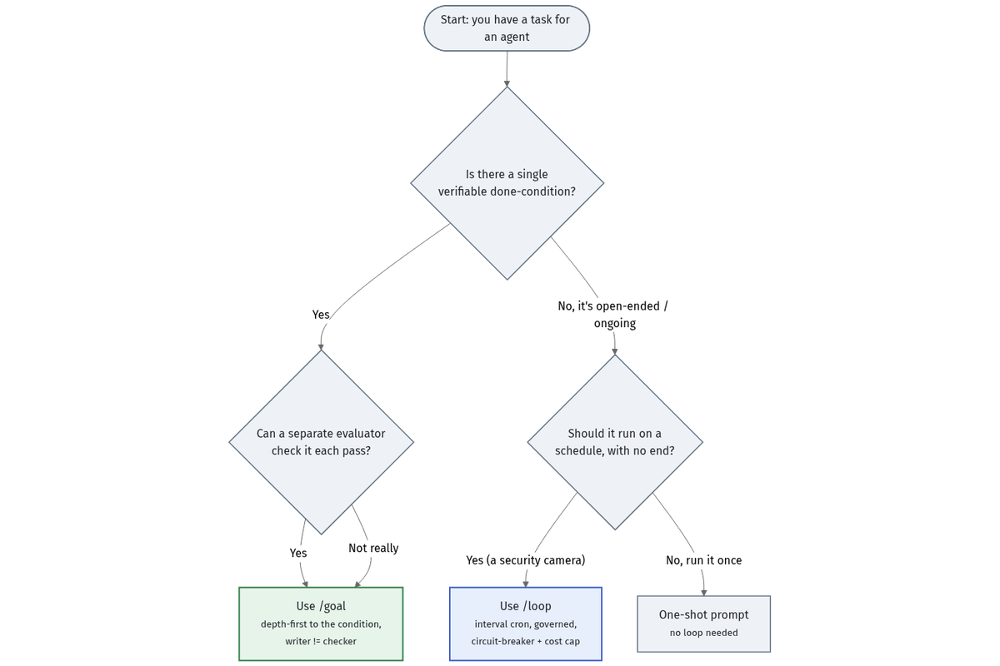
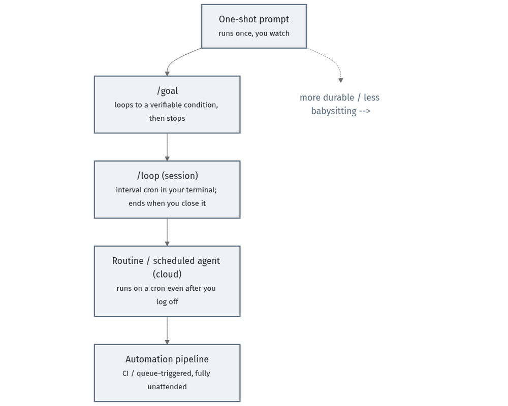

# /goal vs /loop basics

Two primitives cover most of loop engineering. Pick by the shape of the work.

## /goal vs /loop

- **`/goal`** — runs **depth-first toward a single verifiable condition**, then
  **stops**. A *separate evaluator* checks the condition each pass (writer ≠
  checker). Use it for babysat work with a clear "done": fix this bug, reconcile
  this ledger to `$0.00`, get this score past the gate.
- **`/loop`** — runs on an **interval, with no built-in end** (a cron in your
  terminal). Use it as a *security camera*: watch a queue, re-review on change,
  patrol for regressions. Because it never ends on its own, `/loop` lives or dies
  by its **governance** (a done-when-nothing-changed check, a no-progress halt, a
  cost cap).

## The decision

Rule of thumb: **if there's a verifiable done-condition, reach for `/goal` first.**
Use `/loop` when the work is genuinely ongoing — and govern it hard.

## The tool matrix

Where the primitives show up across tools (*as of June 2026 — verify before
relying*; see [SOURCES.md](../SOURCES.md#tooling)):

| Tool | `/goal`-style | `/loop`-style | Durable / scheduled |
|------|---------------|---------------|---------------------|
| Claude Code | yes | yes (session) | via scheduled agents |
| Codex | yes | yes | via Automations |
| Cowork | yes | partial | via routines |
| OpenCode | yes | yes | DIY cron |

Treat the cells as *illustrative* of the shape, not a feature contract — verify
against each tool's current docs.

## The durability ladder

How "durable" a loop is = how little babysitting it needs and how long it
survives you walking away:

One-shot → `/goal` → `/loop` (session) → scheduled agent (cloud) → automation
pipeline. Climb only as far as the task needs: more durability means more
governance to get right.

## The loop contract fields

Both primitives run better with an explicit **loop contract** — six fields that
say what "done" means and what happens when it isn't. The canonical template
lives in [the loop contract](the-loop-contract.md); the fields are Goal,
Context, Constraints, Done-when, Evidence, and If-blocked.

---

Next: [Benefits →](03-benefits.md)
