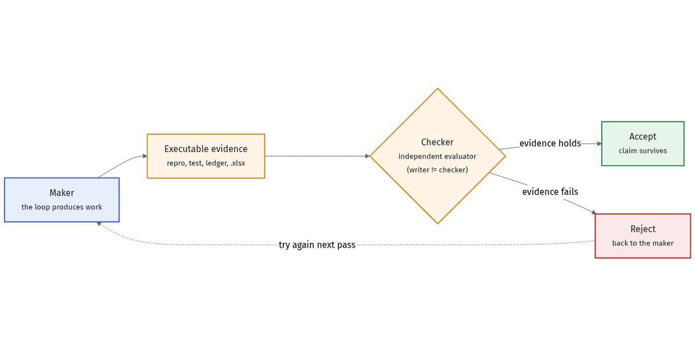

# Benefits: why loops work and where they pay

## Why it works

A governed loop externalizes the four things a single long chat does badly:

1. **State** — each pass starts from the repo/artifacts on disk plus a small
   memory file (`LOOP.md`), not a giant transcript. Fresh context beats
   *context rot*.
2. **Verification** — a *separate* evaluator checks the work, so the agent can't
   grade its own homework. This is the **maker-checker** pattern:

   

3. **Timing** — the loop decides *when* to run again (on change, on interval, on
   a failed gate) instead of you babysitting a prompt.
4. **Governance** — stop conditions, no-progress halts, and cost caps are
   first-class, so "run until done" doesn't mean "run until bankrupt."

The payoff shows up in the worked examples: the security loop
([example 3](../examples/3-claim-ledger-security/artifacts.md)) only accepts a
finding backed by a runnable repro, and the reconciliation loop
([example 5](../examples/5-ad-spend-reconciliation/artifacts.md)) won't stop
until variance hits `$0.00` — the gate, not the model's confidence, decides.

## Where it pays

- **Engineering** — overnight code review, reproduce-before-you-fix, multi-loop
  refactors, flaky-test quarantine.
- **Operations** — reconciliation, spend audits, deliverability, queue patrols.
- **Non-coding knowledge work** — questionnaire/RFP packs that must cite a
  source, research that must verify a claim before keeping it.

The common thread: work with a **checkable artifact** at the end. If you can
write the done-condition, you can engineer the loop.

## Usage in practice

Self-reported, illustrative usage split for how teams spend loop time
(*illustrative — as of June 2026, verify before relying*; see
[SOURCES.md](../SOURCES.md#figures-and-statistics)): roughly **56%** engineering,
**17%** operations, **13%** non-coding knowledge work, remainder experimental.
Treat these as directional, not measured.

---

Next: [Risks and cost →](04-risks-and-cost.md)
