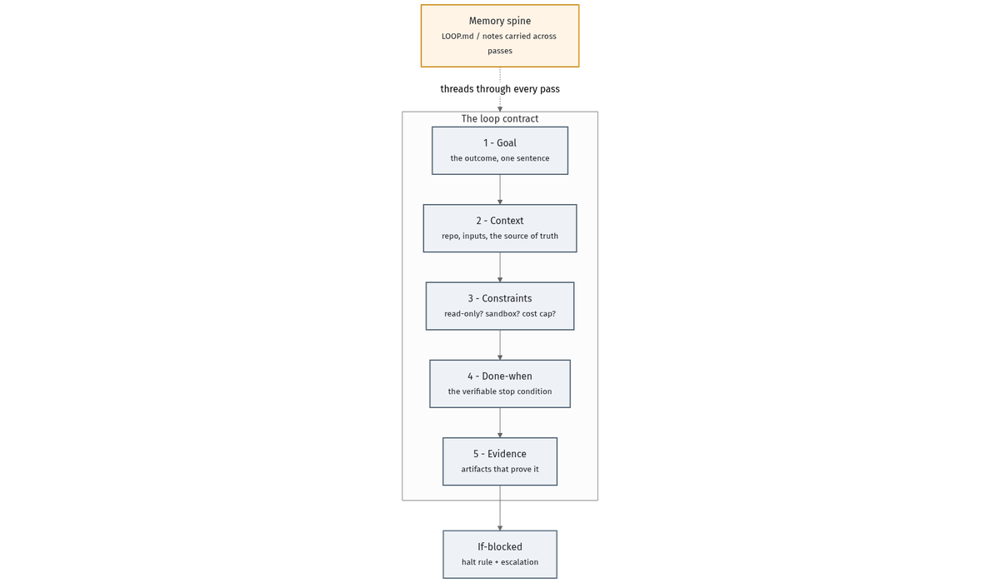

# The loop contract

The hero artifact of this whole repo. Six fields turn "run an agent in a loop"
into a **governed, verifiable** loop. Copy the block below, fill every field, and
you have a loop worth leaving alone.



## The contract

```
Goal:        <the outcome, in one sentence>
Context:     <repo / inputs / the source of truth the agent may use>
Constraints: <read-only? sandbox/worktree? cost cap? rate?>
Done-when:   <the single verifiable stop condition a separate checker can test>
Evidence:    <the artifacts that prove Done-when is met (logs, repro, ledger, .xlsx)>
If-blocked:  <halt rule + escalation: max no-progress passes, wall-clock cap, who to ask>
```

The six fields, and why each exists:

- **Goal** — one sentence. If it needs three, it's two loops.
- **Context** — names the *only* inputs the agent may treat as truth (this is
  what makes citation/reconciliation loops honest).
- **Constraints** — the blast-radius controls: read-only, sandbox, cost cap.
- **Done-when** — the verifiable condition. A *separate* evaluator must be able
  to test it (writer ≠ checker).
- **Evidence** — the receipts that prove Done-when. No evidence, not done.
- **If-blocked** — the governance escape hatch: when to halt, when to ask a human.

A "Memory spine" (a small `LOOP.md`) threads across passes so a fresh-context run
knows what earlier passes already did — see the
[durability ladder](02-goal-and-loop-basics.md#the-durability-ladder).

> This contract is **canonical** — the single source of truth for the six fields.
> The README hero ("Loop in 30 seconds") and the prompt-library cards, added in
> later stages, are built to reuse this exact template verbatim.

---

Back to [the guide index](README.md) · [glossary](glossary.md)
