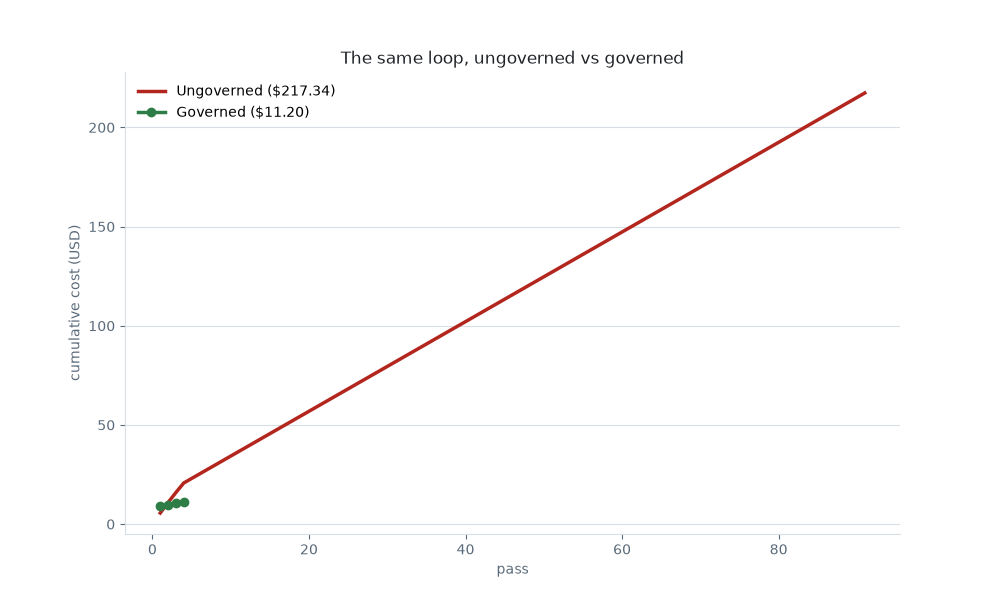

# 1. The $217 Overnight Code Review

> **Reconstruction for teaching.** Fictional org (`Meridian/payments-gateway`), synthetic data; the receipts are generated, not from a real run. The dollar figures (including the `$217` in the title) are illustrative — as of June 2026, verify before relying.

**Pattern:** circuit-breaker + cost cap · **Primitive:** `/loop` · **Domain:** coding

## Use when

You want an agent to review an open-PR queue continuously, overnight or between standups — without it re-reviewing unchanged PRs forever and billing you for the privilege.

## The loop (copy-paste)

This is the [library card](../../library/loops/engineering/overnight-217-review.md) for this example. Copy the contract and fill the brackets:

```
Goal:        Review every open PR in <repo> once per changed revision.
Context:     <repo> at HEAD; the open-PR queue and each PR's head SHA.
Constraints: Read-only. One comment per PR per changed SHA. Hard cap <$N>/night.
Done-when:   No PR has changed head SHA since the last pass.
Evidence:    A per-pass diff of PR head SHAs; a posted-comments ledger.
If-blocked:  Halt after 3 consecutive no-progress passes; never exceed the cost cap.
```

## Verify

A separate check compares each PR's head SHA to the prior pass. If none changed, the done-condition holds and the loop halts. The [comments ledger](comments-posted.md) must show at most one comment per PR per SHA.

## Steps

1. Snapshot the PR queue and head SHAs.
2. Review only PRs whose SHA changed since the last pass.
3. Record cost + SHAs; halt on 3 no-progress passes or at the cap.

## What happened

Run unattended overnight, the **ungoverned** loop re-reviewed the same 12-PR queue **91** times and billed **$217.34** — 87 of those passes found nothing new, just re-read an unchanged queue every ~5 minutes. The **governed** version (Done-when: no PR changed; halt after 3 no-progress passes; a $15/night cap) did the same job in **4** passes for **$11.20**. *(Illustrative — as of June 2026, verify before relying.)*



## The receipts

- [Loop log (91 passes)](loop-log.jsonl) — `no_new_work=true` from pass 5 on.
- [Ungoverned cost ledger](cost.csv) and [governed cost ledger](cost-governed.csv).
- [Comments posted](comments-posted.md) — one PR, 91 near-identical bot comments.
- [The governed loop contract](FIXED-loop-contract.md) · [all artifacts](artifacts.md).

## Notes

The fix isn't a smarter model — it's a **Done-when** the model can't argue with (no PR changed) plus a **circuit-breaker** (3 no-progress passes) and a **cost cap**. Govern before you leave it running.
