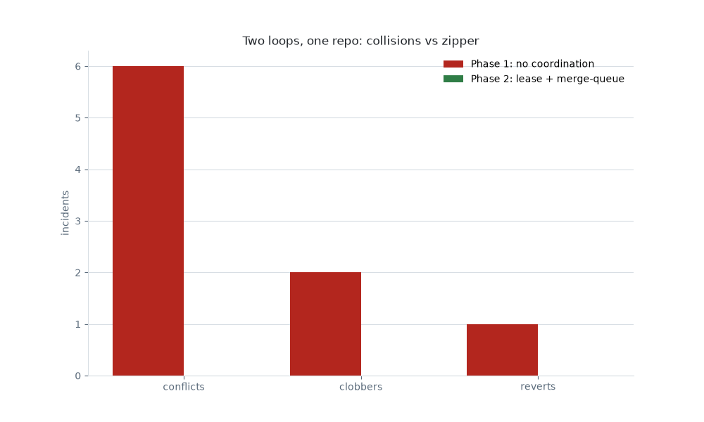

# 2. Two Loops, One Repo

> **Reconstruction for teaching.** Fictional org (`Solstice/api`), synthetic data; the receipts are generated, not from a real run.

**Pattern:** multi-loop coordination · **Primitive:** `/loop` ×2 · **Domain:** coding

## Use when

Two independent loops need to edit the same repo (a refactor loop and a docs loop). Without coordination they overwrite each other; with a file-lease and a merge-queue they take turns.

## The loop (copy-paste)

This is the [library card](../../library/loops/engineering/two-loops-one-repo.md) for this example. Copy the contract and fill the brackets:

```
Goal:        Make <change A> and <change B> on <repo> with two loops, no conflicts.
Context:     <repo>; a lease dir (.loop-lease/) holding path-glob leases with TTL.
Constraints: Acquire a lease on your path glob before editing; heartbeat every 30s.
Done-when:   Both changes landed via the merge queue with zero conflicts/clobbers.
Evidence:    A conflicts ledger (must be 0); lease snapshots; the merge-queue order.
If-blocked:  On LOCK DENIED, BACKOFF(30s) and retry; never edit a leased path.
```

## Verify

A separate check reads the [conflicts ledger](conflicts.csv): in the coordinated phase, conflicts, clobbers, and reverts must all be zero, and every edit must map to a held lease.

## Steps

1. Each loop requests a lease on its path glob (TTL + heartbeat).
2. On denial, back off and retry; on grant, edit then land via the merge queue.
3. Record every lease grant/denial + merge to the ledger.

## What happened

**Phase 1 (no coordination):** the two loops collided — **6** conflicts, **2** clobbers, and **1** revert — and burned **2.3**× the tokens of Phase 2 redoing clobbered work. **Phase 2 (lease + heartbeat/TTL + merge-queue):** **0** conflicts. The lease turned a crash into a zipper. *(Illustrative — as of June 2026, verify before relying.)*



## The receipts

- [Conflict / coordination events](conflicts.csv) — phase 1 vs phase 2.
- [Lease snapshot](loop-lease.json) — holder, TTL, a `BACKOFF(30s)` denial.
- [Loop A log (refactor)](loop-log-A.md) · [Loop B log (docs)](loop-log-B.md).
- [Cost ledger (both phases)](cost.csv) · [all artifacts](artifacts.md).

## Notes

The coordination primitive is a **lease directory** + a **merge-queue**, not a smarter model. The `LOCK DENIED / BACKOFF(30s)` dance is what keeps two loops from clobbering each other.
