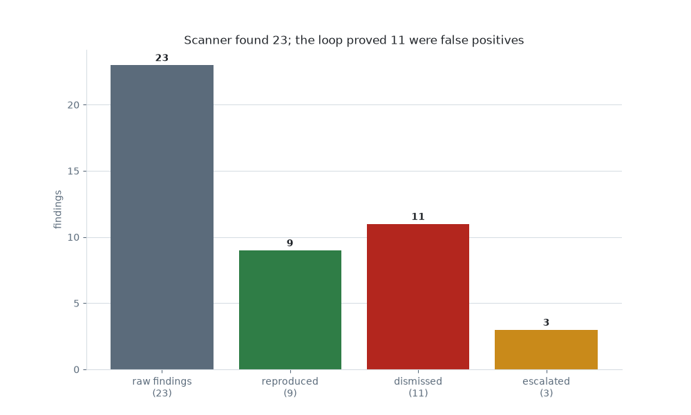

# 3. Claim-Ledger Security Fix

> **DEFENSIVE / TEACHING RECONSTRUCTION.** Fictional org (`VaultDesk`), fictional advisory IDs, synthetic CVSS, local teaching PoCs only (descriptions, not runnable exploit code). No real product, no real vulnerability.

**Pattern:** maker-checker on executable evidence · **Primitive:** `/goal` · **Domain:** coding

## Use when

A scanner reports a pile of "criticals" and you suspect most are false positives. You want a ledger that separates reproduced issues from noise, with a runnable repro behind every accepted finding.

## The loop (copy-paste)

This is the [library card](../../library/loops/engineering/claim-ledger-security.md) for this example. Copy the contract and fill the brackets:

```
Goal:        Prove or dismiss every scanner finding on <target> with executable evidence.
Context:     The scanner output; a local sandbox of <target>; the patch branch.
Constraints: Defensive only, local sandbox. No finding is "real" without a runnable PoC.
Done-when:   Every finding is reproduced (PoC red->green on patch), dismissed, or escalated.
Evidence:    A findings ledger + a repro/ folder; an independent verifier re-ran each PoC.
If-blocked:  If a PoC cannot be made reliably red, mark the finding dismissed with a reason.
```

## Verify

An independent verifier (not the agent that wrote the PoC) re-runs each repro against the patch: reproduced findings go red-before / green-after; dismissed findings carry a falsifiable reason. See the [findings ledger](findings-ledger.csv) and an example PoC ([`repro/VD-2026-001/poc.md`](repro/VD-2026-001/poc.md)).

## Steps

1. Triage each finding into the ledger.
2. For candidates, build a sandbox PoC that reliably reproduces the issue.
3. Patch, re-run via an independent verifier, record the verdict.

## What happened

The scanner reported **23** findings. The loop reproduced **9** (a PoC exploited each, then the patch closed it), dismissed **11** as false positives (it tried to exploit each and failed), and escalated **3** (reproduced, but the patch was insufficient). The headline: the scanner's 23 "criticals" were really 9 — the loop proved 11 were lies by trying to exploit each and failing. *(Illustrative — as of June 2026, verify before relying.)*



## The receipts

- [Findings ledger](findings-ledger.csv) — 23 = 9 reproduced + 11 dismissed + 3 escalated.
- [`repro/VD-2026-001/`](repro/VD-2026-001/poc.md) — failing-then-passing teaching PoCs (descriptions only; one per reproduced/escalated finding).
- [Loop log](loop-log.md) · [cost ledger](cost.csv) (repro dominates spend) · [all artifacts](artifacts.md).

## Notes

The trust comes from **executable evidence + an independent checker** (writer ≠ checker), not the scanner's severity label. Run everything in a local sandbox; this is defensive teaching material only.
