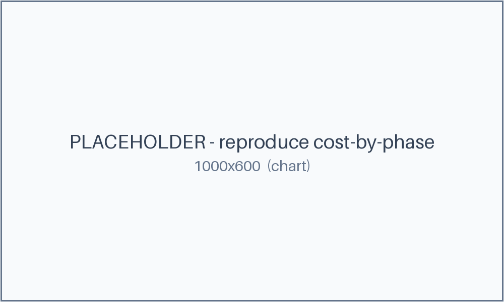

# 4. Reproduce-Before-You-Fix

> **Reconstruction for teaching.** Fictional org (`GridDesk`), synthetic data; the receipts are generated, not from a real run.

**Pattern:** reproduction-gate · **Primitive:** `/goal` · **Domain:** coding

## Use when

A regression needs fixing and you want to forbid touching source until the bug is *reliably* reproduced — so the fix addresses a proven cause, not a guess.

## The loop (copy-paste)

This is the [library card](../../library/loops/engineering/reproduce-before-fix.md) for this example. Copy the contract and fill the brackets:

```
Goal:        Fix the regression in <repo> only after proving it is real.
Context:     <repo>; the suspected bad range; a way to run the failing scenario repeatedly.
Constraints: FORBIDDEN to edit source until a test is reliably red (e.g. 10/10 runs fail).
Done-when:   The reproducing test was red pre-fix and is green post-fix.
Evidence:    A repro-gate log (attempts until reliably red); a git-bisect trail; the diff.
If-blocked:  If the bug will not reproduce reliably, stop and report — do not guess a fix.
```

## Verify

A separate check confirms the [gate log](repro-gate.log) shows a reliably-red test (10/10 runs fail) *before* the first source edit, and that the same test is green after the fix.

## Steps

1. Try to reproduce until the test is reliably red; keep the gate closed until then.
2. Bisect the range to the culprit commit.
3. Apply the minimal fix; re-run to green.

## What happened

It took **5** attempts to make the bug reliably red (the first four were flaky — the gate stayed closed). Only then did the loop bisect a **60**-commit range to the culprit, and the real fix was a **1**-line cache-TTL change. The loop "knew" a plausible fix early but refused to apply it until it could prove the bug was real. *(Illustrative — as of June 2026, verify before relying.)*



## The receipts

- [Reproduction gate log](repro-gate.log) — 4 flaky attempts, then a reliably-red 5th.
- [git bisect trail](git-bisect-trail.md) — 60 → 1 commit, then the one-line diff.
- [Loop log (gate checks)](loop-log.jsonl) · [cost ledger](cost.csv) · [all artifacts](artifacts.md).

## Notes

The **reproduction-gate** is the whole trick: source edits are forbidden until the bug is reliably red. It trades a little time up front for a fix you can prove.
