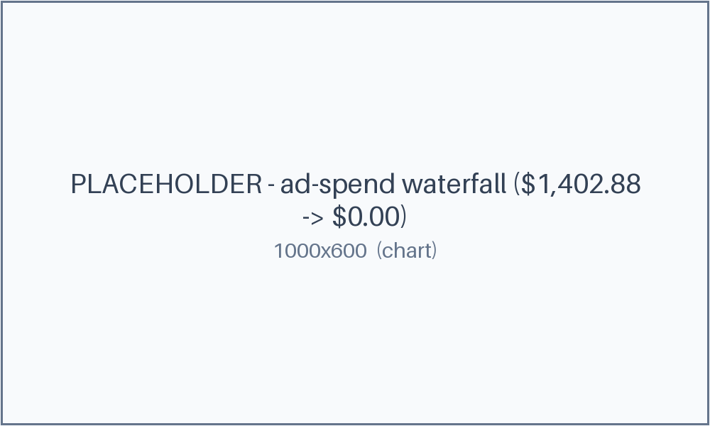

# 5. Ad-Spend Reconciliation

> **Reconstruction for teaching.** Fictional brand (`Lumen Goods`), synthetic invoices + bank export; the receipts are generated, not from a real run.

**Pattern:** validation-gate over messy data · **Primitive:** `/goal` · **Domain:** non-coding

## Use when

You have invoices and a bank export that almost match — mismatched dates, a duplicate, mixed currencies, orphan charges — and you need them reconciled to the cent, with every exception explained.

## The loop (copy-paste)

This is the [library card](../../library/loops/operations/ad-spend-reconciliation.md) for this example. Copy the contract and fill the brackets:

```
Goal:        Reconcile <period> invoices against the bank export to zero variance.
Context:     The invoices file and the bank export; the chart-of-accounts/fee rules.
Constraints: Do not invent matches. If a charge cannot be classified, ASK for a rule.
Done-when:   Summary variance == 0 and unmatched rows == 0.
Evidence:    A workbook (Raw / Normalized / Matched / Exceptions / Summary) that balances.
If-blocked:  Pause and ask the human for a classification rule; then re-run to zero.
```

## Verify

A separate check opens the [`reconciliation.xlsx`](reconciliation.xlsx) Summary tab: the variance cell must read **$0.00** and unmatched rows must be **0**; every exception must carry a resolution.

## Steps

1. Normalize currencies/dates and de-duplicate.
2. Match invoices to bank charges; collect the rest as exceptions.
3. Resolve exceptions (ask for rules as needed) until variance is zero.

## What happened

Variance started at **$1,402.88** and walked to **$0.00**: normalizing the EUR/GBP invoices closed most of it, de-duplicating one invoice closed more, and resolving 3 orphan bank charges (with a human "ask-for-rule" step for an ad credit) closed the rest. Total agent cost: about **$2.10** — the Summary cell flipped from red to green `BALANCED`. *(Illustrative — as of June 2026, verify before relying.)*



## The receipts

- [`reconciliation.xlsx`](reconciliation.xlsx) — Raw / Normalized / Matched / Exceptions / Summary.
- Inputs: [messy invoices](inputs/invoices.csv) · [bank export](inputs/bank-export.csv).
- [Exceptions resolved](exceptions-resolved.csv) · [loop log](loop-log.md) · [cost ledger](cost.csv) · [all artifacts](artifacts.md).

## Notes

The gate is **arithmetic, not vibes**: done means variance is exactly zero and nothing is unmatched. When the loop couldn't classify a charge, it **asked for a rule** instead of guessing — that's the human approval gate.
