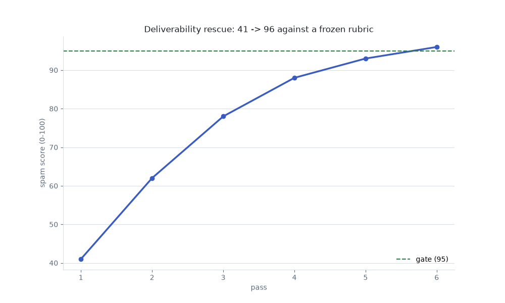

# 7. Deliverability Rescue (climb to 95)

> **Reconstruction for teaching.** Fictional newsletter (`The Tradewind Brief`), synthetic rubric + drafts; the receipts are generated, not from a real run.

**Pattern:** metric-climb with an independent grader · **Primitive:** `/goal` · **Domain:** non-coding

## Use when

Copy must clear a spam/quality threshold and you want the agent to improve it iteratively — scored by a *separate* grader so it can't mark its own homework.

## The loop (copy-paste)

This is the [library card](../../library/loops/content/deliverability-rescue.md) for this example. Copy the contract and fill the brackets:

```
Goal:        Rewrite <asset> until the independent scorer rates it >= <gate>/100.
Context:     The draft; a FROZEN rubric; a separate scorer that never sees the writer's reasoning.
Constraints: The writer may not edit the rubric or the scorer (writer != scorer).
Done-when:   The separate scorer returns a score >= <gate> on the frozen rubric.
Evidence:    A score ledger (one row per pass, with the signal fixed); before/after drafts.
If-blocked:  After <K> passes without improvement, stop and surface the stuck signal.
```

## Verify

A separate scorer — not the writer — evaluates the final draft against the [frozen rubric](rubric.md) and must return a score at or above the gate. The [score ledger](score-ledger.csv) must show a non-decreasing climb.

## Steps

1. Score the baseline draft with the independent scorer.
2. Fix the lowest-scoring signal; re-score; repeat.
3. Stop when the score clears the gate (or stalls).

## What happened

The re-engagement email started at a spam score of **41** (`before.html`: ALL-CAPS subject, image-only body, no unsubscribe) and climbed pass by pass — fixing one signal each time — to **96**, clearing the **95** gate (`after.html`). Red SPAM to green INBOX, with a separate scorer deciding each step. *(Illustrative — as of June 2026, verify before relying.)*



## The receipts

- [Score ledger](score-ledger.csv) — 41 → 62 → 78 → 88 → 93 → 96, signal fixed each pass.
- [Frozen rubric](rubric.md) — the independent grader's rules.
- Diptych: [before (SPAM 41)](before.html) vs [after (INBOX 96)](after.html).
- [Loop log](loop-log.md) · [cost ledger](cost.csv) · [all artifacts](artifacts.md).

## Notes

The discipline is **writer ≠ scorer** on a **frozen rubric**: the writer never edits the grader, so the climb is real and not the model talking itself into a higher number.
