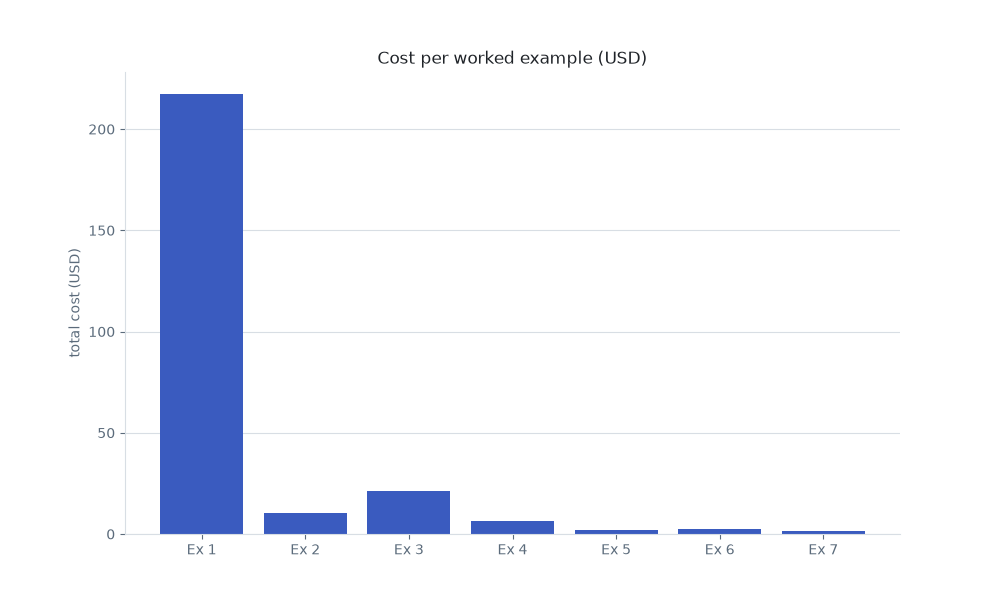
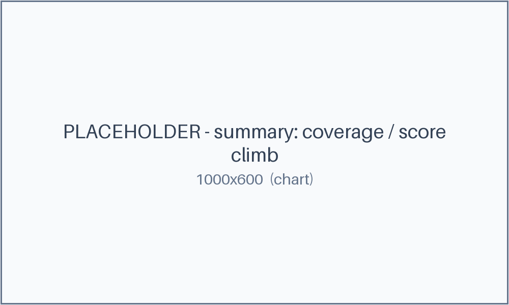
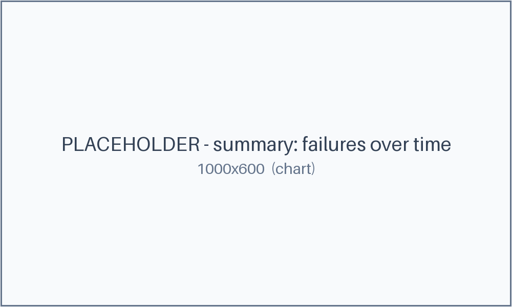

# The worked examples

Seven loops, each shown *actually running* with the receipts: iteration logs, cost
ledgers, before/after, charts, and (for two of them) real `.xlsx` output. Everything
is synthetic and carries a "reconstruction for teaching" label; the dollar figures are illustrative — as of June 2026, verify before relying.

| # | Example | Domain | Primitive | What it proves |
|---|---------|--------|-----------|----------------|
| 1 | [The $217 Overnight Code Review](1-overnight-217-review/README.md) | coding | `/loop` | circuit-breaker + cost cap (ungoverned vs governed) |
| 2 | [Two Loops, One Repo](2-two-loops-one-repo/README.md) | coding | `/loop` ×2 | multi-loop coordination (lease + merge-queue) |
| 3 | [Claim-Ledger Security Fix](3-claim-ledger-security/README.md) | coding | `/goal` | maker-checker on executable evidence |
| 4 | [Reproduce-Before-You-Fix](4-reproduce-before-fix/README.md) | coding | `/goal` | reproduction-gate (prove the bug first) |
| 5 | [Ad-Spend Reconciliation](5-ad-spend-reconciliation/README.md) | non-coding | `/goal` | validation-gate over messy data (`.xlsx`) |
| 6 | [RFP / Security Questionnaire Pack](6-rfp-questionnaire-pack/README.md) | non-coding | `/goal` | citation claim-ledger / cite-or-cut (`.xlsx`) |
| 7 | [Deliverability Rescue (climb to 95)](7-deliverability-rescue/README.md) | non-coding | `/goal` | metric-climb with an independent grader |

Four coding, three non-coding; every example owns a distinct loop pattern.

## The numbers, side by side

Cost per example, and the metric-climbers reaching their gate:

## How to read an example

Each example folder follows the same shape:

- **README.md** — the narrative: Use-when, the copy-paste loop contract (the same
  one in the [prompt library](../library/README.md)), Verify, Steps, "What
  happened", and the chart.
- **headline.json** — the example's quoted numbers. Every figure in the README
  prose is checked against this file, so the receipts and the story can't drift.
- **the artifacts** — `loop-log.*`, `cost.csv`, ledgers, inputs/output, and the
  `.xlsx` where applicable. `artifacts.md` lists them all.

Start with [the overnight review](1-overnight-217-review/README.md) — it's the
clearest "ungoverned vs governed" contrast.

[Back to the handbook](../README.md)
